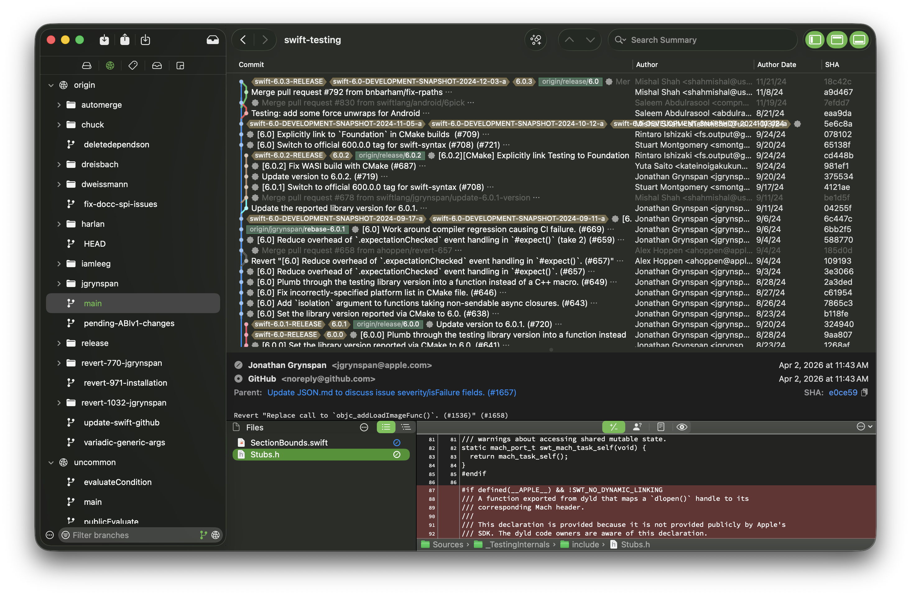

# Xit

Xit (pronounced "exit") is a graphical tool for working with git repositories. The overall goals are:

  * A useful graphical interface for viewing and managing your repository
  * Stability and scalability - handle large repositories well (lots of commits and lots of files)
  * A well-organized codebase to facilitate continued development

# Background and current status

Xit began as a rewrite of GitX, born from a desire for a codebase that was easier to work with, thoroughly unit tested, etc. It is currently in beta, where most basic features are in place. You can check the GitHub issues and milestones to see what is planned.

# Features

* **Sidebar** showing branches, remotes, tags, submodules, and stashes.
  * If you sign in with your TeamCity account, you can see build status for branches you have pushed.
  * If you sign in with your Bitbucket Server account, you can see and act on pull requests.
  * Support for more services, such as GitHub, is in the works.
* **History list** with a graph of commits and branches.
  * Search the list by author, message content, or hash.
  * Navigate backwards and forwards through your history of selected commits.
* **File lists and previews** for workspace files and previous commits.
  * See just the files that changed, or use the outline view to browse the whole hierarchy at any commit.
  * Preview files as diffs, blame, plain text, or QuickLook.
  * Blame view has color coding to show lines that changed at the same time, and links back to the commit they came from.

# Roadmap

The plan is to have a concrete 1.0 milestone to provide a good foundation and firm direction moving forward. Version 1.0 will simply be a starting point covering basic usage, plus some fun extras like the beginnigs of online service integration.

Plenty of advancements are on the post-1.0 list, like syntax highlighting and other diff view enhancements, file history, etc.

Some other ideas that I’m looking forward to working on (and using!):

  * More robust push and pull, and better handling of merge conflicts
  * Interacting more with git hosting services (especially GitHub): discovering forks, viewing commits online, working with pull requests
  * Interactive rebase
  * Explore more ways to navigate and visualize the repository

Please see the [CONTRIBUTING.md](CONTRIBUTING.md) file for information on building Xit and contributing to the project.
